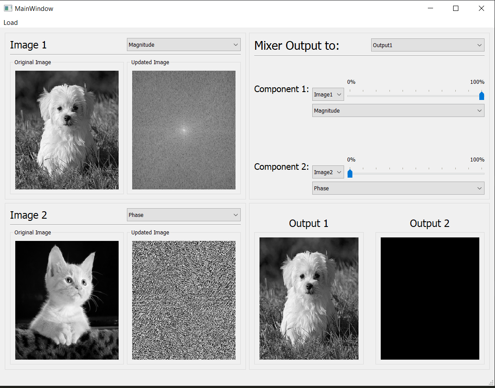
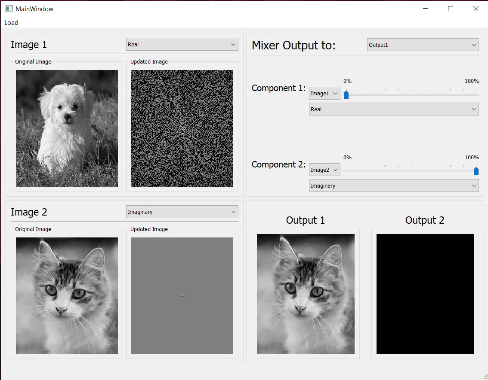

### Write your name and ID
## Name: Abdullah Mohammed Alrefaey
## ID: Section #2 - B.N: 8

# MagnitudePhaseMixerTemplate
Starter Template for Magnitude Phase Mixer Task

## install opencv to run the test file

## Implement the ImageModel in imageModel.py and its mix function
## run testTask.py --> python testTask.py
## assign a valid path for image1Path and image2Path
## Now when you run testTask you should get the following line
### AssertionError: This is not a numpy array, check the return value of your implemented mix function

## when you implement the mix function correctly you should get the following 2 lines
### Modes.magnitudeAndPhase passed successfully
### Modes.realAndImaginary passed successfully

## Do not forget to update the dep.txt file

# Results
## Case #1:
### Mixing 100% Magnitude of Image1 And 0% Phase of Image2 

## Case #2:
### Mixing 0% Real of Image1 And 100% Imaginary of Image2 

## Case #3:
### Mixing 70% Real of Image1 And 70% Imaginary of Image2 

